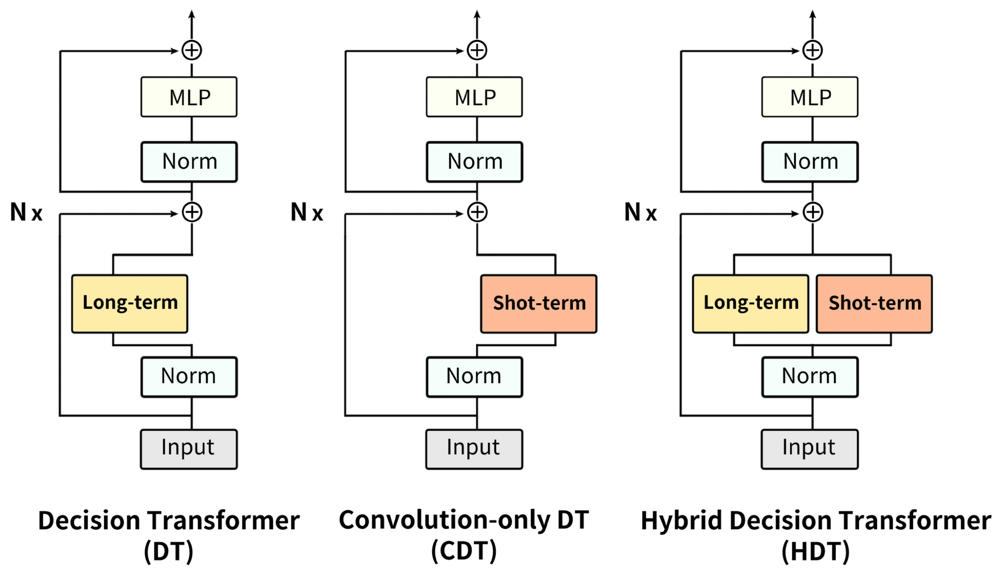
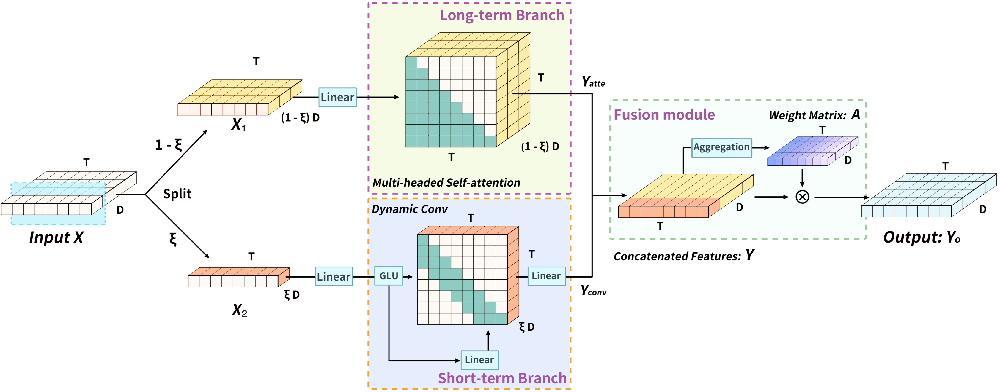

# Long-Short Decision Transformer: Bridging Global and Local Dependencies for Generalized Decision-Making

This repository provides the official implementation of **Long-Short Decision Transformer (LSDT): Bridging Global and Local Dependencies for Generalized Decision-Making**, which introduces a two-branch Transformer architecture combining self-attention and convolution for reinforcement learning (RL) tasks with both Markovian and non-Markovian properties. 

## Overview

<table>
  <tr>
    <td></td>
    <td></td>

  </tr>
</table>

## Dataset Preparation
To use our goal-state concatenation method, you first need to download and preprocess the dataset.

```Dowload_normal_datset
python3 data/download_d4rl_datasets_nogoal.py
```
```Dowload_goal-state concatenation_datset
python3 data/Data_with_Goal_download.py
```


## Acknowledgements
Our code is based on the implementation of [Decision Convformer](https://github.com/beanie00/Decision-ConvFormer),[Fair](https://github.com/facebookresearch/fairseq/tree/main/fairseq) and [min-decision-transformer](https://github.com/nikhilbarhate99/min-decision-transformer).
